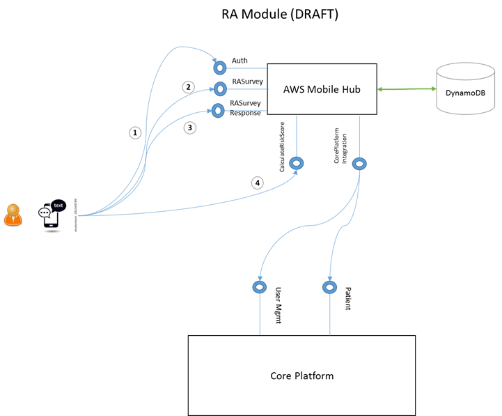

# Welcome to Breathe!
"master" branch is a production ready branch. For development use "develop" branch.
# Git
- [Our Git Branching Model](http://nvie.com/posts/a-successful-git-branching-model/)
- [Git Workflow](https://ecgit01.corp.edifecs.com/help/workflow/README.md)

# Android
- [Android Tutorials](https://www.udacity.com/courses/android)

# Risk Assessment Module

- 